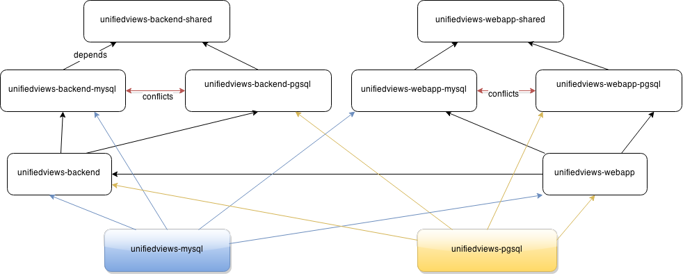

Packages
========

Provides source for creating UnifiedViews packages for various Linux distributions.

How to install with dependency 

~~~bash
echo "deb http://packages.comsode.eu/debian wheezy main" > /etc/apt/sources.list.d/odn.list
wget -O - http://packages.comsode.eu/key/odn.gpg.key | apt-key add -
apt-get update
~~~

To install unifiedview using postgresql
~~~bash
apt-get install unifiedviews-pgsql
~~~

To install unifiedview using mysql
~~~bash
apt-get install unifiedviews-mysql
~~~

How to create .deb packages for Debian:

go to where pom.xml is placed and run
~~~bash
mvn package
~~~

that creates files .deb in target/

The known issues:
- be aware of the possible problem - https://github.com/UnifiedViews/Core/issues/258
- to add backup configuration before an update installation of packages
- to clean database schema during a purge phase 
- to change location from /etc/unifiedviews to /etc/default/unifiedviews

